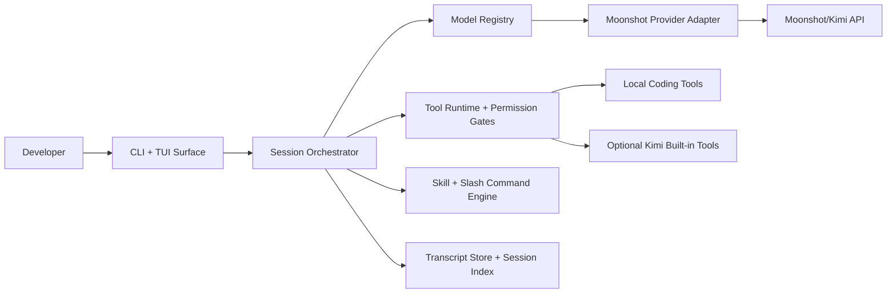

# Kimicode

Kimicode is a Kimi-first coding agent CLI for Moonshot models.

It is built as a clean-room, public OSS project around Moonshot's documented API surface. The first release centers on a strong terminal workflow: session persistence, local coding tools, approval gates, model-aware provider rules, and a small starter skill pack that is authored directly for Kimicode.

## Why Kimicode

- Default model: `kimi-k2.6`
- Future Kimi models land through a model registry, not core rewrites
- Local coding tools are first-class, with approval modes for read-only, workspace-write, and full-auto
- Session transcripts are append-only JSONL for replay and debugging
- Session metadata is indexed in SQLite for fast resume and search

## Architecture



## Workspace layout

- `apps/kimicode-cli`
- `packages/core`
- `packages/provider-moonshot`
- `packages/tools`
- `packages/skills-starter`
- `packages/testkit`

## Install

```bash
pnpm install
pnpm build
pnpm test
```

## Commands

- `kimicode`
- `kimicode run "fix the failing build"`
- `kimicode run "continue this plan" --session <session-id>`
- `kimicode resume`
- `kimicode resume <session-id> --continue "take the next step"`
- `kimicode models`
- `kimicode doctor`
- `kimicode config`
- `kimicode config init`
- `kimicode export [session-id] [output-path]`

Slash commands inside the prompt surface:

- `/plan`
- `/tdd`
- `/review`
- `/debug`
- `/docs`
- `/model`
- `/status`
- `/clear`

## Sessions

- Every run writes an append-only transcript at `.kimicode/sessions/<session-id>/transcript.jsonl`
- The session index lives at `.kimicode/session-index.sqlite`
- System prompts are persisted with the transcript so resumed sessions keep the same workflow framing
- `kimicode export` prints a session snapshot plus transcript JSON, or writes it to a path you choose

## Configuration

Project config lives in `kimicode.config.json`.

Environment variables:

- `MOONSHOT_API_KEY`
- `KIMICODE_MODEL`
- `KIMICODE_APPROVAL_MODE`
- `KIMICODE_SESSION_ID`

See [docs/architecture.md](./docs/architecture.md) for the runtime breakdown.
