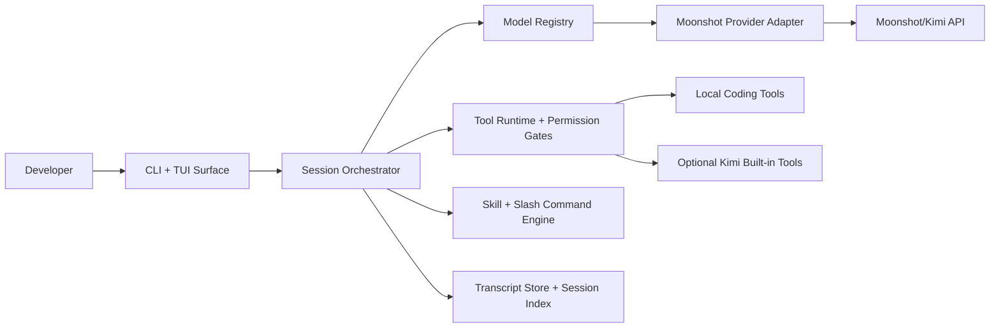

# Kimicode

Kimicode is a Kimi-first coding agent CLI for Moonshot models.

It is built as a clean-room, public OSS project around Moonshot's documented API surface. The first release centers on a strong terminal workflow: session persistence, local coding tools, approval gates, model-aware provider rules, and a small starter skill pack that is authored directly for Kimicode.

## Why Kimicode

- Default model: `kimi-k2.6`
- Future Kimi models land through a model registry, not core rewrites
- Local coding tools are first-class, with approval modes for read-only, workspace-write, and full-auto
- Moonshot official tools can be enabled explicitly, with formula-backed tools loaded from the live API
- Session transcripts are append-only JSONL for replay and debugging
- Session metadata is indexed in SQLite for fast resume and search

## Architecture



## Workspace layout

- `apps/kimicode-cli`
- `packages/core`
- `packages/provider-moonshot`
- `packages/tools`
- `packages/skills-starter`
- `packages/testkit`

## Install

```bash
pnpm install
pnpm verify
```

## Commands

- `kimicode`
- `kimicode run "fix the failing build"`
- `kimicode run "continue this plan" --session <session-id>`
- `kimicode resume`
- `kimicode resume <session-id> --continue "take the next step"`
- `kimicode models`
- `kimicode doctor`
- `kimicode tools`
- `kimicode config`
- `kimicode config init`
- `kimicode config official-tools --enable`
- `kimicode config official-tools --add-formula fetch`
- `kimicode export [session-id] [output-path]`

Slash commands inside the prompt surface:

- `/plan`
- `/tdd`
- `/review`
- `/debug`
- `/docs`
- `/model`
- `/status`
- `/clear`

## Sessions

- Every run writes an append-only transcript at `.kimicode/sessions/<session-id>/transcript.jsonl`
- The session index lives at `.kimicode/session-index.sqlite`
- System prompts are persisted with the transcript so resumed sessions keep the same workflow framing
- Transcript reads recover valid events when a run is interrupted mid-line, so partial tail corruption does not discard the whole session
- `kimicode export` prints a session snapshot plus transcript JSON, or writes it to a path you choose

## Configuration

Project config lives in `kimicode.config.json`.

Environment variables:

- `MOONSHOT_API_KEY`
- `KIMICODE_MODEL`
- `KIMICODE_APPROVAL_MODE`
- `KIMICODE_ENABLE_OFFICIAL_TOOLS`
- `KIMICODE_OFFICIAL_TOOL_FORMULAS`
- `KIMICODE_SESSION_ID`

## Official tools

- Official Moonshot tools stay opt-in through `enableOfficialTools`
- Formula URIs are configured with `officialToolFormulas`
- `kimicode config init` seeds a starter list for `web-search`, `fetch`, `date`, and `code_runner`
- `kimicode tools` shows the local tool surface immediately, and `kimicode tools --resolve-official` resolves configured official tools through the live API
- `kimicode config official-tools` manages the opt-in flag and formula list without editing JSON manually
- Built-in `$web_search` is still model-aware and filtered automatically when thinking-mode rules would reject it

## Release Notes

- `pnpm verify` runs the build, test, and lint gates together
- `pnpm pack:dry-run` checks the actual publishable package tarballs locally
- `pnpm publish:packages --dry-run` runs the offline publish sequence in dependency order
- `pnpm release:check` runs the main verification gate plus package dry-runs
- `pnpm release:version patch` bumps the workspace version and rolls the changelog
- `pnpm release:tag --dry-run` previews the next release tag without mutating git
- `pnpm test:live` runs the gated Moonshot smoke suite and requires `MOONSHOT_API_KEY`
- publishable packages ship only built artifacts, and `@kimicode/skills-starter` also ships its `skills/` assets

## GitHub Automation

- `.github/workflows/ci.yml` runs `pnpm verify` on pushes and pull requests, then validates publishable tarballs with `pnpm pack:dry-run`
- `.github/workflows/live-smoke.yml` is a manual workflow that runs the real Moonshot smoke suite when the repository has a `MOONSHOT_API_KEY` secret configured
- `.github/workflows/release.yml` runs `pnpm release:check`, publishes packages when `NPM_TOKEN` is configured, and creates GitHub releases for `v*` tags
- both workflows opt GitHub JavaScript actions into Node 24 now, so they are ahead of the runner deprecation window

## Community

- Security reporting guidelines live in [SECURITY.md](./SECURITY.md)
- Contributor behavior expectations live in [CODE_OF_CONDUCT.md](./CODE_OF_CONDUCT.md)
- GitHub issue and PR templates are checked into `.github/` so public contributions start with the right context

See [docs/architecture.md](./docs/architecture.md) for the runtime breakdown.

Release steps live in [docs/releasing.md](./docs/releasing.md).
