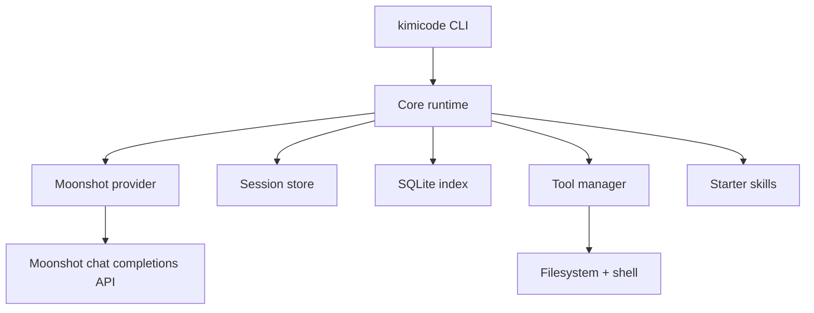

# Kimicode Architecture

Kimicode is split into a small set of packages so the provider, runtime, tools, and skills can evolve independently.

## Runtime graph

## Package roles

- `apps/kimicode-cli`: public commands and TUI rendering
- `packages/core`: model registry, config loading, session lifecycle, transcript persistence, slash commands
- `packages/provider-moonshot`: Moonshot adapter and Kimi request shaping
- `packages/tools`: local tool registry, approval policy, shell and file operations
- `packages/skills-starter`: starter slash-command and skill metadata
- `packages/testkit`: fake provider helpers for golden and contract tests

## Session storage

- Transcripts: `.kimicode/sessions/<session-id>/transcript.jsonl`
- Session index: `.kimicode/session-index.sqlite`

The transcript is the source of truth. The SQLite index makes listing and resuming sessions fast.
