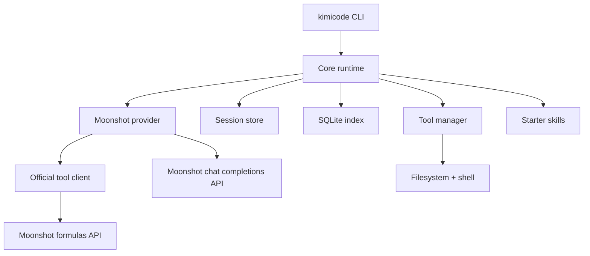

# Kimicode Architecture

Kimicode is split into a small set of packages so the provider, runtime, tools, and skills can evolve independently.

## Runtime graph

## Package roles

- `apps/kimicode-cli`: public commands and TUI rendering
- `packages/core`: model registry, config loading, session lifecycle, transcript persistence, slash commands
- `packages/provider-moonshot`: Moonshot adapter and Kimi request shaping
- `packages/tools`: local tool registry, approval policy, shell and file operations, plus optional official-tool passthrough
- `packages/skills-starter`: starter slash-command and skill metadata
- `packages/testkit`: fake provider helpers for golden and contract tests

## Session storage

- Transcripts: `.kimicode/sessions/<session-id>/transcript.jsonl`
- Session index: `.kimicode/session-index.sqlite`
- Transcript events include the persisted system prompt, user turns, assistant turns, tool calls, tool results, approvals, warnings, and completion status
- Transcript writes are append-only, and reads recover valid events if the final line is truncated by an interrupted run

The transcript is the source of truth. The SQLite index makes listing and resuming sessions fast.

## Command surface

- `kimicode run "<task>"` starts a new task, and `--session <id>` continues an existing session
- `kimicode resume [session-id]` inspects the latest or requested session, and `--continue "<prompt>"` resumes execution
- `kimicode config init` writes a starter project config without requiring an API key
- `kimicode export [session-id] [output-path]` emits a serialized session snapshot plus its full transcript
- Slash commands are routed before provider execution so local commands like `/status` and `/model` work without hitting the API
- When `enableOfficialTools` is on, the CLI loads formula-backed Moonshot tools once per run and feeds them through the same tool loop as local tools
